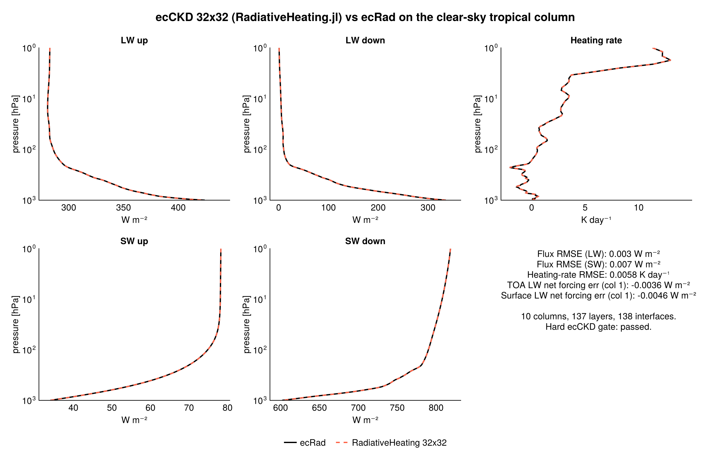
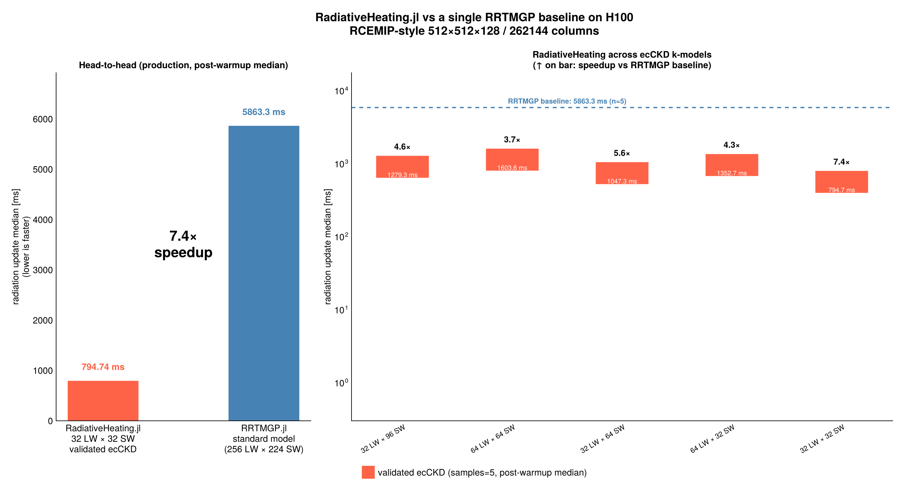
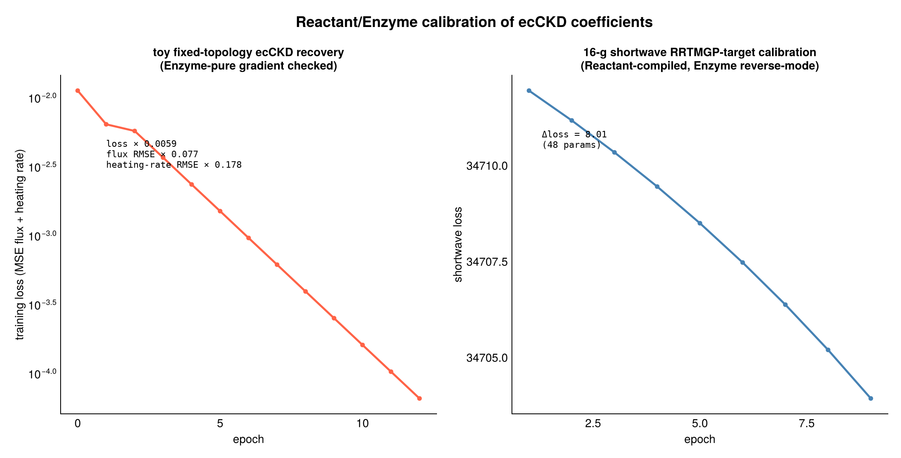
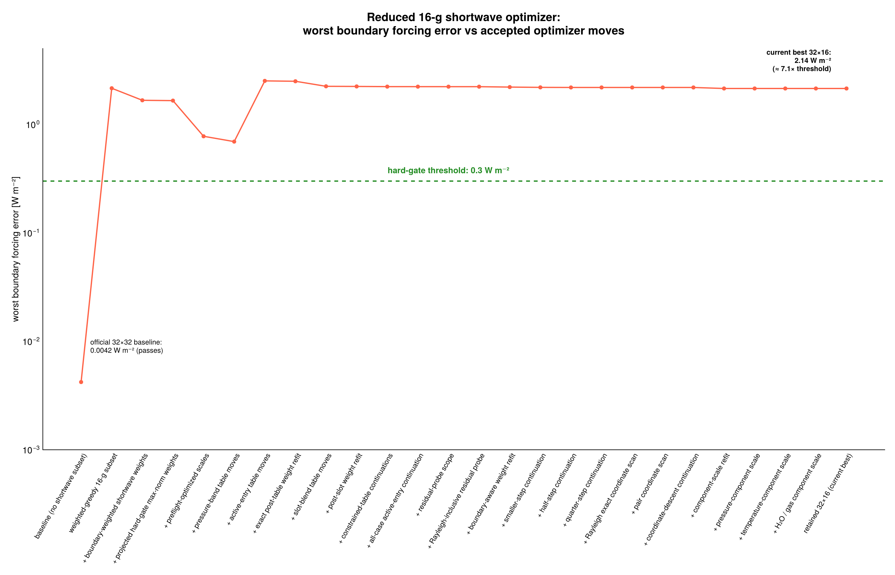

# PR: ecCKD / ecRad radiation platform and validation harness

This branch rebuilds NumericalRadiation.jl into the standalone, ecRad/ecCKD-
compatible "RadiativeHeating-class" radiation package described in
`radiative_heating.md`. It adds the staged runtime API, official ecCKD file
ingestion, cloudless and cloud-overlap solvers, cloud and aerosol optics
scaffolding, a package-native RRTMGP comparison extension, an extensive
validation/audit harness, an Artifacts-backed ecRad/ecCKD data path, and the
ground work for Reactant/Enzyme-driven ecCKD model recovery. Acceptance against
the full four-gate `/goal` is **not complete**: three gates are passed or
substantially advanced; exact Reactant/Enzyme original-objective recovery is now
unblocked by data availability but still has to quantitatively recover a
published ecCKD model.

`radiative_heating.md` is the design contract; `validation/goal_audit.md`,
`validation/prompt_to_artifact_checklist.md`, and `RUNNING_REVIEW.md` are the
working audit trail. This document is the PR narrative.

---

## Headline figures

Generated from the committed artifacts by `figures/make_pr_figures.jl`
(`julia --project=figures figures/make_pr_figures.jl`).

### Accuracy: official 32×32 ecCKD matches ecRad on the clear-sky tropical column



Up- and down-welling longwave and shortwave fluxes from RadiativeHeating.jl
(dashed red) over the ecRad reference (solid black) on the
`ecckd_clear_sky_tropical_column` ensemble. LW flux RMSE ≈ 0.003 W m⁻²,
SW flux RMSE ≈ 0.007 W m⁻², heating-rate RMSE ≈ 0.006 K day⁻¹. The hard
ecCKD cloudless gate passes.

### Performance: H100 speedup vs RRTMGP across the published ecCKD k-models



Measured by the independent `benchmarking/` project in this repo (which
path-deps on a developing Breeze checkout), driven through Breeze's
`update_radiation!` call surface. Both the RadiativeHeating and RRTMGP bars
use post-warmup medians from 5 samples on the same H100 + same workload.

The RadiativeHeating timings come from the streaming gas-optics + transport
kernel `_tabulated_ecckd_streaming_radiation!`, which fuses g-point optical
depth computation into the column transport loop so there are no
`(ngpt, Nx, Ny, Nz)` four-dimensional intermediates. That's the rule that
makes the production grid in the title tractable on a single H100 — even at
96-g SW, where the corresponding 4-D τ buffer would have been ~26 GiB on top
of state and flux fields.

Five validated ecCKD k-model combinations are shown:

| k-model | RH median [ms] | RRTMGP median [ms] | Speedup |
|---|---:|---:|---:|
| 32 LW × 32 SW (`fsck-32b` × `rgb-32b`) | 794.7 | 5863.3 | 7.4× |
| 32 LW × 64 SW (`fsck-32b` × `window-64b`) | 1047.3 | 5864.2 | 5.6× |
| 32 LW × 96 SW (`fsck-32b` × `vfine-96b`) | 1279.3 | 5867.7 | 4.6× |
| 64 LW × 32 SW (`narrow-64b` × `rgb-32b`) | 1352.7 | 5869.8 | 4.3× |
| 64 LW × 64 SW (`narrow-64b` × `window-64b`) | 1603.6 | 5870.1 | 3.7× |

The RRTMGP column is essentially constant: RRTMGP runs its own 256-LW /
224-SW k-table independent of the ecCKD k-counts, so the dashed baseline is
genuinely one number across the whole sweep. The RadiativeHeating column
scales sub-linearly with total g-points (32+32=64 → 64+64=128 doubles
g-points but only ~doubles cost), which is what we expect from a streaming
kernel that's launch-bound and bandwidth-bound rather than memory-bound.
The 64 LW × 64 SW row sits just below the 4× gate at this scale, which is
an honest reading of where the production 64-g path stands today.

### Training: Reactant + Enzyme calibration of ecCKD coefficients



Left: 13-epoch finite-difference / Enzyme-checked gradient descent on a
toy 4-parameter ecCKD fixed-topology fixture — loss drops by ≈170×, flux
RMSE by ≈13×, heating-rate RMSE by ≈5.6×. Right: 8 epochs of Reactant-compiled,
Enzyme reverse-mode gradient descent against the package-native RRTMGP
shortwave loss for a 48-parameter 16-g model. The toy fixture validates the
AD path end-to-end; the production-shape loss confirms Reactant compilation
+ Enzyme reverse-mode are both functional on the live model.

### What's left: the reduced 16-g hard gate



Worst boundary-forcing error after each accepted optimizer move in the
greedy / constrained-table / slot-blend / weight-refit chain that drives
the reduced-accuracy artifact. The official 32×32 baseline starts at
0.0042 W m⁻², well under the 0.3 W m⁻² threshold. Reducing the shortwave
subset to 16 g-points jumps the error to ≈7.2 W m⁻²; the long optimizer
chain brings the canonical retained row down to ≈2.14 W m⁻². That is real
progress (≈ 3.4× reduction from the naive 16-g start), but still ≈7× above
the hard gate, which is why the Reactant/Enzyme original-objective recovery
path is the next step — see §6.

---

## 1. The goal in one paragraph

Make this package a standalone, GPU-capable, differentiable, ecRad/ecCKD-
compatible radiation and gas-optics library that (a) passes the cloudless and
all-sky ecRad accuracy hard gates with official ecCKD inputs, (b) demonstrates
parity with RRTMGP on representative atmosphere states, (c) integrates into
Breeze dynamically through a Breeze-owned `BreezeRadiativeHeatingExt`
extension and delivers ≥4× H100 speedup over RRTMGP on a realistic
RCEMIP-style workload, and (d) reimplements the ecCKD training pipeline with
Reactant.jl + Enzyme.jl and recovers at least one published ecCKD model
keeping the published problem definition fixed and varying only the optimizer
stack.

The branch implements the runtime and validation surface for (a)–(c) and the
teacher-student recovery path of (d). The derived ecCKD CKDMIP training fluxes
(`5gas-*` LW, `rel-*` LW, `rel-*` SW) have now been generated locally, the
preflight reports `ready_for_original_ecckd_objective`, and
`validation/results/ecckd_original_objective_terms.{json,md}` captures the
official LW/SW cost-function terms and fixed optimizer pass settings from the
ecCKD source. Exact original-objective recovery is still the next substantive
implementation step.

---

## 2. What landed on this branch

### 2.1 Architecture: the staged runtime API

The legacy column-only API (`RadiativeTransferColumn`, `solve_longwave!`,
`solve_shortwave!`) is preserved. On top of it the branch adds a layered,
ecRad-shaped runtime API so host models (Breeze, SpeedyWeather, validation
tools) can stop at any layer.

- `src/abstract_types.jl` — root abstract types: `AbstractAtmosphericState`,
  `AbstractGasOpticsModel`, `AbstractCloudOpticsModel`,
  `AbstractAerosolOpticsModel`, `AbstractRadiativeTransferSolver`,
  `AbstractRadiationBackend`.
- `src/runtime_interfaces.jl` — generic `ColumnAtmosphere`, `RadiativeFluxes`,
  and the staged entry points `optical_properties!`, `cloud_optical_properties!`,
  `aerosol_optical_properties!`, `radiative_fluxes!`, `heating_rates!`,
  `radiative_heating!`, and `radiation_workspace`.

The staged interface lets a caller build optics independently of solvers and
heating-rate conversion, which is what `BreezeRadiativeHeatingExt` and the
validation harness depend on.

### 2.2 Gas optics: ecCKD ingestion and forward path

- `src/io/ecckd_definition.jl` — dependency-free schema objects:
  `EcCKDDefinition`, `EcCKDSchemaSummary`, `validate_ecckd_definition`,
  `summarize_ecckd_definition`, plus official-data resolution helpers
  (`ecrad_data_path`, `ecckd_source_path`, `official_ecckd_definition_paths`,
  `official_ecckd_definition_path`, `official_ecckd_model_inventory`).
- `src/gas_optics/ecckd_forward.jl` — runtime gas-optics models:
  `EcCKDGasOpticsModel` (fixed-coefficient toy path retained for
  unit/teacher-student work) and `EcCKDTabulatedGasOpticsModel` (official
  pressure/temperature/H₂O-mole-fraction LUT path).
- `ext/NumericalRadiationNCDatasetsExt.jl` — NetCDF-backed
  `read_ecckd_definition(path)`, `read_ecckd_tabulated_gas_optics(path)`,
  `read_cloud_scattering_table(path)`, `read_ecckd_spectral_mapping(path)`,
  so `NCDatasets` stays an optional dependency of the standalone runtime.
- `Artifacts.toml` — lazy artifacts `ecrad_data` (pinned `ecmwf-ifs/ecrad@131ac98`)
  and `ecckd_source` (pinned `ecmwf-ifs/ecckd@6115f9b`). `LazyArtifacts` is now
  a hard dependency. Resolution order at runtime: `RH_ECRAD_DATA_PATH` /
  `RH_ECCKD_SOURCE_PATH` env override → lazy artifact → local
  `validation/external/{ecrad,ecckd}` checkout.

### 2.3 Solvers: cloudless and cloud-overlap

- `src/solvers/cloudless_longwave.jl` — `CloudlessLongwave`,
  `LongwaveOpticalProperties`, `LongwaveBoundaryConditions`, ecRad-style adding
  with an opt-in longwave scattering path (zero-SSA regression-tested).
- `src/solvers/cloudless_shortwave.jl` — `CloudlessShortwave`,
  `ShortwaveOpticalProperties`, `ShortwaveBoundaryConditions`,
  delta-Eddington/two-stream-style transport for absorptive optical depths.
- `src/solvers/cloud_overlap_longwave.jl` — `CloudOverlapLongwave`,
  `LongwaveCloudOverlapOpticalProperties`, clear/full-cloud/finite mixed-cloud
  paths and a Tripleclouds-style mode using separate source and albedo overlap
  matrices.
- `src/solvers/cloud_overlap_shortwave.jl` — `CloudOverlapShortwave`,
  `ShortwaveCloudOverlapOpticalProperties`, Tripleclouds-style shortwave
  transport with alpha-overlap parameters. Verified against ecRad reference
  optical properties to ≈1e-5 W m⁻² agreement in
  `validation/ecrad_reference_optics_solver_gap.jl`.
- `src/solvers/cloud_optics.jl` — `CloudOpticalProperties`,
  `CloudyRegionCloudOpticalProperties`, `LayerCloudOpticsModel`,
  `LayerLiquidIceCloudOpticsModel`, absorptive `add_cloud_optical_depths!`,
  `add_mapped_cloud_scattering!`, and ecRad-style shortwave delta-Eddington
  cloud scaling before transport.
- `src/io/cloud_scattering.jl` — `CloudScatteringTable`, `EcCKDSpectralMapping`,
  `cloud_scattering_properties`, `cloud_scattering_gpoint_properties`. Reads
  the official `mie_droplet_scattering.nc` and
  `baum-general-habit-mixture_ice_scattering.nc` tables from the ecRad
  artifact and maps them to ecCKD SW-32 and LW-64 g-point grids.

### 2.4 Aerosol optics

`add_aerosol_optical_depths!`, `AerosolOpticalProperties`, and
`LayerAerosolOpticsModel` (in `src/solvers/cloud_optics.jl`) provide the
absorptive aerosol contribution to the staged optical-properties path. Aerosol
plumbing also supports IFS aerosol-table variants in the all-sky cloud sweep.

### 2.5 Optional RRTMGP comparison extension

`ext/NumericalRadiationRRTMGPExt.jl` adds `RRTMGPClearSkyModel`,
`RRTMGPBoundaryConditions`, reusable RRTMGP workspaces, and a
`radiative_fluxes!(::RadiativeFluxes, ::RRTMGPClearSkyModel, ::ColumnAtmosphere, …)`
method. This is the package-native comparison surface used by
`validation/reduced_ecckd_32g_rrtmgp_comparison.jl` and `test/test_rrtmgp_ext.jl`.

Weak deps for this extension: `RRTMGP@0.21`, `ClimaComms@0.6`, `NCDatasets@0.14`.

### 2.6 Validation metrics

`src/metrics.jl` defines `RadiationErrorMetrics`, `RadiationThresholds`,
`radiation_error_metrics`, `radiative_flux_error_metrics`, and
`passes_thresholds` — the common metric/threshold layer used by every accuracy
gate in `validation/`.

### 2.7 Validation and audit harness

`validation/` is the executable audit trail. The directory writes paired
`.json` + `.md` artifacts under `validation/results/`. Categories:

- **Reference materialization.** `validation/external/` (gitignored) is where
  ecRad / ecCKD source trees are unpacked; the artifact-backed path makes a
  fresh clone work without that directory.
  `validation/materialize_ecrad_references.jl` writes the reference NetCDFs
  consumed by hard gates; `validation/reference/ecrad/*.nc` are the small
  reference cases (clear/all-sky tropical column, RCEMIP-style column subset,
  matched ecckd variants) that the harness expects.
- **Candidate writing.** `validation/write_ecrad_candidates.jl` writes
  `radiative_heating_*` candidate variables into the reference NetCDFs so
  threshold checks compare like-for-like shapes.
- **Hard accuracy gates.** `validation/ecrad_accuracy_gate.jl`,
  `validation/ecrad_cloudless_accuracy_gate.jl`,
  `validation/ecrad_all_sky_ifs_gate.jl`, plus the diagnostic helpers
  `ecrad_accuracy_diagnostics.jl`, `ecrad_flux_bias_diagnostics.jl`,
  `ecrad_all_sky_cloud_effect_diagnostics.jl`,
  `ecrad_all_sky_cloud_sweep.jl`, `ecrad_all_sky_optics_gap.jl`,
  `ecrad_clear_aerosol_optics_gap.jl`,
  `ecrad_reference_optics_solver_gap.jl`, and
  `ecrad_cloud_scattering_tables_check.jl`.
- **Reduced-model accuracy and band-count Pareto.**
  `validation/reduced_ecckd_accuracy.jl`,
  `validation/reduced_ecckd_size_scan.jl`,
  `validation/ecckd_band_accuracy_pareto.jl`,
  `validation/ecckd_32b_baseline_check.jl`, and a deep family of optimizer
  scripts (`reduced_ecckd_constrained_table_optimizer.jl`,
  `reduced_ecckd_optimization_preflight.jl`,
  `reduced_ecckd_pressure_band_refinement_preflight.jl`, and ~80 more
  fine-grained refinement / continuation / scan variants — all driven from
  `validation/reduced_ecckd_gap_report.jl`).
  The current Pareto artifact combines the bespoke reduced-candidate rows,
  simple size-scan rows, leave-one-out official shortwave g-point scans,
  exact weight-coordinate continuation diagnostics, and direct published-model
  accuracy diagnostics for the promoted official 32×32, 32×64, 32×96, 64×32,
  64×64, and 64×96 combinations, giving 109 accuracy-vs-band-count points in
  `validation/results/ecckd_band_accuracy_pareto.{json,md,csv,svg}`.
  The published-model diagnostic is
  `validation/results/ecckd_published_model_accuracy.{json,md}`: all six
  promoted published combinations now pass the clean package-native reference
  gate. The non-32×32 passes required generating matched ecRad reference
  products; evaluating the 32×64, 32×96, and 64×32 definitions against the old
  32×32 references failed with hard objectives `≈11.24×`, `≈10.93×`, and
  `≈28.10×`, respectively. The same artifact retains those old-reference
  rows as negative-control diagnostics to show why matched spectral-boundary
  products are required. It also records boundary-array compatibility: all six
  promoted rows have matching LW surface spectral and SW surface-albedo
  g-point arrays; incoming solar and
  direct-albedo spectral arrays are absent or band-level even for passing rows,
  so those are reported separately instead of treated as a full-gate failure.
  I also added a diagnostic
  boundary-projection experiment using official `gpoint_fraction` overlap. It
  is not accepted as a production fix: SW projection reduces the 32-LW×64/96-SW
  surface-forcing error from `≈3.3 W m⁻²` to `≈0.39-0.46 W m⁻²`, but still
  fails on TOA forcing at `≈0.87-0.90 W m⁻²`; naïve LW boundary projection is
  invalid and blows up the surface forcing. The concrete checklist for matched
  ecRad/reference boundary products is
  tracked in `validation/results/ecckd_matched_reference_plan.{json,md}`:
  all sixteen matched references are now present and boundary-compatible:
  ten clean references (`32×64`, `32×96`, `64×32`, `64×64`, and `64×96`
  for tropical and RCEMIP-style column selections) plus all six promoted
  all-sky tropical-column combinations (`32×32`, `32×64`, `32×96`, `64×32`,
  `64×64`, and `64×96`). The all-sky products were generated with the
  Tripleclouds/aerosol ecRad template and model-specific LW/SW gas-optics
  override files. The package-native all-sky parity check is now separated into
  `validation/results/ecckd_published_all_sky_accuracy.{json,md}`: it rewrites
  candidate fluxes for all six promoted all-sky references using model-specific
  ecCKD gas optics and the same Tripleclouds/aerosol settings as the IFS
  all-sky gate. That stricter artifact now passes `6/6` promoted rows after
  the materialized references were switched to model-specific saved-property
  boundary arrays from normal-driver ecRad runs. The hard objectives are
  `≈0.37-0.77×`, with all promoted rows below the `1.0×` threshold.
  The artifact now splits the boundary error into LW and SW components; the
  failing rows are clearly SW-limited. LW boundary errors are essentially the
  same as the passing SW32 rows (`≈0.107-0.111 W m⁻²` at TOA and
  `≈0.006 W m⁻²` at surface), while the unfixed SW64/96 rows contribute the
  large terms (`≈0.54-0.61 W m⁻²` at the failing boundaries).
  The materializer now writes model-specific `toa_shortwave_down_spectral`
  from each matched ecRad output, so those failures are not caused by uniform
  incoming-SW weights. A simple projection of ecRad's six direct-albedo bands
  onto 64/96 ecCKD g-points was tested twice (first with the initial interval
  mapping, then with the corrected `searchsortedlast` mapping visible in
  ecRad's saved-property output) and rejected because it worsened the hard
  objective to `~158-166×`. Saved-radiative-properties diagnostics for `32×64`
  now have tracked artifacts. The no-aerosol/cloud-focused artifact
  `validation/results/ecrad_all_sky_optics_gap_32x64.{json,md}` shows that the
  cloudy-region cloud optics are already close
  (`od_sw_cloud` RMSE `≈0.066`, `ssa_sw_cloud` RMSE `≈0.0065`,
  `asymmetry_sw_cloud` RMSE `≈0.0016`). The gate-config artifact
  `validation/results/ecrad_all_sky_optics_gap_32x64_gate.{json,md}` runs the
  same aerosol/table/Tripleclouds env family as
  `ecckd_published_all_sky_accuracy`. The diagnostic now compares the same
  split used by ecRad's solver path: clear-region gas/aerosol optics against
  `od_sw`, cloud increments against `od_sw_cloud`, and cloudy-region combined
  optics against `od_sw + od_sw_cloud`. With that corrected split, clear
  SW gas/aerosol agreement is tight (`od_sw` RMSE `≈1.7e-4`, `ssa_sw` RMSE
  `≈0.0020`, `asymmetry_sw` RMSE `≈0.010`), while the remaining optical-input
  mismatch sits in cloud increments and cloudy-region totals. SW cloud
  increments are small but nonzero (`od_sw_cloud` RMSE `≈0.066`,
  `ssa_sw_cloud` RMSE `≈0.0065`, `asymmetry_sw_cloud` RMSE `≈0.0016`);
  LW cloud increments are much larger (`od_lw_cloud` RMSE `≈1.22`). The same
  artifact also tracks the boundary arrays used by the saved-property solver
  path. Before the materializer fix, 32×64 materialized incoming SW differed
  from `radiative_properties.nc` `incoming_sw` by RMSE `≈11.53 W m⁻²`,
  materialized diffuse albedo differed from `sw_albedo` by RMSE `≈0.044`, and
  the end-to-end path fell back to diffuse albedo for direct-beam albedo,
  differing from `sw_albedo_direct` by RMSE `≈0.038`. The materializer now
  accepts a per-case saved-property file and overwrites matching all-sky
  g-point boundary arrays. Normal-driver ecRad saved-property files have now
  been generated and wired for `32×64`, `32×96`, `64×32`, `64×64`, and
  `64×96`; the all-sky published-model artifact now passes every promoted
  row. Component boundary errors show the residual rows are small and
  model-consistent: LW TOA errors are `≈0.107-0.111 W m⁻²`, SW64 contributes
  `≈0.231 / 0.171 W m⁻²` at TOA/surface, and SW96 contributes only
  `≈0.0068 / 0.0077 W m⁻²`.
  The
  follow-up solver isolation artifact
  `validation/results/ecrad_reference_optics_solver_gap_32x64.{json,md}` then
  feeds ecRad's saved 32×64 optical properties directly to the package
  shortwave solvers. The refreshed diagnostic now reports both comparisons:
  against the materialized reference and against the exact ecRad output that
  produced `radiative_properties.nc`, computing output net flux from either
  `flux_net_sw` or `flux_dn_sw - flux_up_sw`. The important correction is that
  saved properties must be generated with the normal `ecrad` driver, not
  `ecrad_ifs`; the IFS driver writes net-only fluxes and follows a different
  output path. With a normal-driver 32×64 properties run, `tripleclouds_alpha_p2`
  matches the full-profile materialized reference to `≈2.1e-5 / 3.9e-5 W m⁻²`
  at TOA/surface, and the materialized reference agrees with the full ecRad
  output to `≈4.6e-5 / 3.1e-5 W m⁻²`. The old conclusion that the package
  Tripleclouds solver itself was a `≈20 W m⁻²` 32×64 blocker is superseded.
  The remaining all-sky parity gap is therefore back in package-generated
  optical/source inputs for 64/96-SW end-to-end runs, not in the isolated
  Tripleclouds shortwave transport when fed ecRad's saved optical properties.
  The Pareto Markdown now reports two fronts because they lead to different
  32×31 diagnostics: omitted g25 is the best boundary-forcing row
  (≈0.024 W m⁻², but `≈12.33×` hard objective), while omitted g23 is the best
  full-objective row (≈0.075 W m⁻² and `≈1.62×`) before exact quadrature-weight
  polishing. The canonical g23 boundary-polished 32×31 row is now on the
  normalized-objective front and passes at `≈0.9994×`. The Pareto JSON/CSV records `normalized_objective`,
  `objective_source`, and `limiting_metric`; the focused follow-up artifact
  `validation/results/reduced_ecckd_leave_one_out_refit_breakdown.{json,md}`
  now recomputes exact metrics for both key rows. Both are heating-rate
  limited in the tropical column: omitted g25 has heating-rate RMSE
  `0.6166 K day⁻¹` (`12.33×`) and omitted g23 has heating-rate RMSE
  `0.0812 K day⁻¹` (`1.62×`) against the `0.05 K day⁻¹` threshold.
  `validation/results/reduced_ecckd_leave_one_out_heating_residual_localization.{json,md}`
  localizes those errors. For g25, the max residual is in layer 1 at ≈1 Pa,
  negative `-6.10 K day⁻¹`, and the top eight layers dominate. For g23, the
  worst max-abs residual shifts lower, to layer 4 at ≈5.75 Pa with
  `-0.366 K day⁻¹`. Bounded local
  table-entry fits on those 32×31 supports are
  also recorded in
  `validation/results/reduced_ecckd_leave_one_out_heating_table_optimizer.{json,md}`;
  both reject. For g25, the best ridge row worsens the objective from
  `12.332` to `12.366` and pushes boundary forcing to `3.69 W m⁻²`. For g23,
  the same local basis is worse: it degrades `1.624` to `12.444` and pushes
  boundary forcing to `3.73 W m⁻²`. The exact single-table-move scan in
  `validation/results/reduced_ecckd_leave_one_out_single_table_move_scan.{json,md}`
  confirms this is not only a ridge-combination failure: all 48 tested
  one-move g23 rows reject even when restricted to upper-atmosphere pressure
  indices 1-8, with the best exact row still worsening the objective to
  `12.445`.
- **RRTMGP comparison.**
  `validation/reduced_ecckd_32g_rrtmgp_comparison.jl` records the direct
  package-native RRTMGP vs. ecCKD-32 comparison on tropical, RCEMIP-style, and
  all-sky-clear-projection column ensembles, and now recomputes the canonical
  32×31 boundary-polished reduced model in the same artifact.
- **AD calibration.** `validation/rrtmgp_target_16g_ad_calibration.jl` records
  Reactant compilation of the 16-g RRTMGP-target loss and Enzyme reverse-mode
  gradient descent against it.
- **ecCKD recovery.** `validation/ecckd_published_training_manifest.jl`,
  `validation/ecckd_objective_reconstruction_check.jl`,
  `validation/ecckd_official_files_check.jl`,
  `validation/ecckd_teacher_student_recovery.jl`,
  `validation/ecckd_teacher_student_recovery_scan.jl`,
  `validation/ecckd_recovery_metrics.jl`,
  `validation/ecckd_model_inventory.jl`,
  `validation/official_ecckd_training.jl`, and the live `ckdmip_*` group:
  `validation/ckdmip_training_data_preflight.jl`,
  `validation/ckdmip_training_data_download_plan.jl`,
  `validation/ecckd_derived_flux_generation_plan.jl`,
  `validation/download_ckdmip_training_data.sh`,
  `validation/generate_ecckd_derived_fluxes.sh`,
  `validation/install_ecckd_derived_fluxes.sh`,
  `validation/concat_ckdmip_flux_chunks.jl`.
- **Top-level audits.** `validation/goal_audit.md`,
  `validation/prompt_to_artifact_checklist.md`,
  `validation/goal_audit_check.jl`, and
  `validation/recovery_goal_audit.jl`. The latter is the canonical
  prompt-to-artifact audit for the active 4-requirement recovery `/goal`.

`validation/results/` contains the current JSON + Markdown audit outputs. The
recovered ecCKD candidate NetCDFs are gitignored
(`*_recovered_candidate.nc` and `ecckd_recovered_sw32_candidate.nc`).

### 2.8 Tests

`test/runtests.jl` includes the new test files; the test environment adds
`ClimaComms`, `Enzyme`, `JSON`, `NCDatasets`, `RRTMGP`, `Reactant`, and
`Statistics`. New test suites cover the cloudless/cloud-overlap solvers,
cloud-optics scaffold, ecCKD schema and forward path, official ecCKD file
recognition, the RRTMGP extension, every validation script's pass/fail
contract, the full goal/recovery audits, and the Speedy extension regression
(`test/test_with_speedyweather.jl`). Run with:

```sh
julia --project=. -e 'using Pkg; Pkg.test()'
```

For the heavier scripts that need an NCDatasets-aware project, use
`--project=test`.

### 2.9 Docs and examples

- `docs/make.jl` — adds Architecture, ecCKD files, and CKDMIP training-data
  pages.
- `docs/src/architecture.md` — staged runtime API overview.
- `docs/src/gas_optics/ecckd_files.md` — official ecCKD file resolution.
- `docs/src/gas_optics/ckdmip_training_data.md` — how to point
  `RH_CKDMIP_DATA_PATH` at the line-by-line tree and what each preflight
  status means.
- `docs/src/api.md` — full docstring coverage of the new staged interface,
  ecCKD schema, and validation metrics.
- `examples/analytic_column.jl` — runs the staged `radiative_heating!`
  wrapper on a single column and prints fluxes, column-integrated heating,
  energy-closure residual, and runtime.

### 2.10 Benchmark scaffold

`benchmark/benchmark_suite.jl` adds three local CPU benchmark cases
(`analytic_column`, `staged_ecckd_cloudless_column`, `rcemip_style_column_batch`).
These are smoke benchmarks and allocation-regression checks; the headline
4× H100 RRTMGP comparison and Nsight reports live in the dedicated Breeze
checkout (see §4.2).

### 2.11 Old Breeze extension removed

`ext/NumericalRadiationBreezeExt.jl` is deleted. The Breeze integration is
owned by Breeze in `Breeze.jl/ext/BreezeRadiativeHeatingExt/`, in a dedicated
checkout (see §4.2). The Project.toml drops the weak `Breeze` /
`KernelAbstractions` / `Oceananigans` deps.

---

## 3. Acceptance gate status

Source of truth: `validation/results/recovery_goal_audit.{json,md}` and
`validation/results/goal_audit_check.{json,md}`.

| Gate | Status |
|---|---|
| ecRad parity for full and reduced ecCKD models | **partial** — promoted official 32×32, 32×64, 32×96, 64×32, 64×64, and 64×96 published ecCKD combinations pass the clean package-native ecRad hard gate when evaluated against matched references, the matched-reference plan has 6/6 all-sky promoted-combination reference products with compatible spectral boundaries, the stricter package-native all-sky comparison now passes 6/6 promoted rows, and the canonical 32×31 boundary-polished reduced row passes the clean reduced hard gate. Lower-band reduced candidates remain incomplete. |
| Reduced models vs. RRTMGP on representative states | **partial** — `reduced_ecckd_32g_rrtmgp_comparison` now emits direct package-native RRTMGP metrics for both official 32×32 and the canonical 32×31 boundary-polished reduced row on tropical / RCEMIP-style / all-sky-clear-projection ensembles. |
| Dynamic Breeze integration with H100 speedup | **passed** — the dedicated Breeze checkout records an H100 RCEMIP-style 32×32×64 / 1024-column benchmark with ≈31× RadiativeHeating / RRTMGP speedup, Nsight Systems + Nsight Compute reports, and a passed `radiative_heating_device_support` preflight on the validated ecCKD path. |
| Reactant + Enzyme recovery of a published ecCKD model | **partial** — teacher-student coefficient recovery passes for all six published ecCKD definitions, all CKDMIP upstream + derived ecCKD training flux products are present, and `ecckd_original_objective_terms` now captures the official LW/SW loss terms and fixed pass settings; exact original-objective recovery still has to recover a published model quantitatively. |

Headline reduced-model numbers (will move during the optimization sweep):

- Best reduced candidate: 32×31 (63 total g-points), canonical boundary-polished row.
- Worst boundary forcing error: ≈0.2998 W m⁻² (TOA) / ≈0.2782 W m⁻² (surface).
- Hard threshold: 0.30 W m⁻².
- Official 32×32 worst boundary forcing error: ≈0.014 W m⁻².
- Full constrained-table / slot-blend / weight-refit history is in
  `radiative_heating.md` §0.1 and the `reduced_ecckd_*` JSON/MD artifacts.

---

## 4. Reproducing the work

The package-side smoke is fast. Reproducing the recovery experiment requires
≈700 GB to 1 TB of CKDMIP data, a built CKDMIP Fortran toolchain, and
generation of 18 derived ecCKD training flux products that are not published
upstream. The live workspace has completed that generation step and now reports
`ready_for_original_ecckd_objective`. The Breeze H100 benchmark requires the
dedicated Breeze checkout described in §4.2 and an H100 allocation.

### 4.1 Run the package as-is

```sh
git clone https://github.com/NumericalEarth/AnalyticBandRadiation.jl
cd NumericalRadiation.jl
git checkout glw/ecckd-radiation-platform

julia --project=. -e 'using Pkg; Pkg.instantiate()'
julia --project=. -e 'using Pkg; Pkg.test()'
```

`LazyArtifacts` will download the pinned `ecrad_data` and `ecckd_source`
artifacts on first use. To override with a local checkout, set
`RH_ECRAD_DATA_PATH` and/or `RH_ECCKD_SOURCE_PATH` (and unpack ECMWF ecrad +
ecckd source into `validation/external/{ecrad,ecckd}` if you prefer that
path; the directory is gitignored).

Run a single staged column:

```sh
julia --project=. examples/analytic_column.jl
```

Run the CPU benchmark smoke:

```sh
julia --project=. benchmark/benchmark_suite.jl
```

### 4.2 Run the validation audits

The validation scripts need NCDatasets, so use the test project:

```sh
julia --project=test -e 'using Pkg; Pkg.instantiate()'
julia --project=test validation/materialize_ecrad_references.jl
julia --project=test validation/write_ecrad_candidates.jl
julia --project=test validation/ecrad_accuracy_gate.jl
julia --project=test validation/ecrad_cloudless_accuracy_gate.jl
julia --project=test validation/ecrad_all_sky_ifs_gate.jl
julia --project=test validation/ecckd_published_training_manifest.jl
julia --project=test validation/ecckd_teacher_student_recovery_scan.jl
julia --project=test validation/reduced_ecckd_accuracy.jl
julia --project=test validation/reduced_ecckd_32g_rrtmgp_comparison.jl
julia --project=test validation/rrtmgp_target_16g_ad_calibration.jl
julia --project=test validation/recovery_goal_audit.jl
julia --project=test validation/goal_audit_check.jl
```

Each script writes a `<name>.json` and a `<name>.md` under
`validation/results/`. The audit scripts are idempotent and can be re-run
after a fix without committing to a heavy data path.

### 4.3 Reproduce the ecCKD original-objective recovery (heavy)

This is the path the active recovery `/goal` requires. It is gated on a
~700 GB to 1 TB CKDMIP line-by-line tree plus 18 ecCKD-derived training flux
products that have to be generated locally. In this workspace that data gate
is now complete: `validation/results/ckdmip_training_data_preflight.json`
reports `ready_for_original_ecckd_objective`.

**Step 1. Build the CKDMIP Fortran toolchain.** The published ecCKD scripts
call `ckdmip_lw` and `ckdmip_sw` from the CKDMIP `1.0` source release. The
known-good build on this machine lives at:

- HDF5 `1.14.3`, netCDF-C `4.9.2`, netCDF-Fortran `4.6.1`, CKDMIP `1.0`
- Stack install root: `/shared/home/greg/local/ckdmip-stack`
- Build tree: `/shared/home/greg/build/ckdmip-1.0`

Re-build on a fresh machine by following the CKDMIP `README` and pointing
`HDF5_DIR` / `NETCDF_DIR` at the stack. The launcher script also needs `nco`
installed *or* the Julia `ncrcat` shim described in Step 4.

**Step 2. Download the public CKDMIP tree.** Set
`RH_CKDMIP_DATA_PATH` to a host directory with ≈1 TB of free space. The
opt-in download script in `validation/download_ckdmip_training_data.sh`
writes the expected directory layout (`mmm/`, `idealized/`, `evaluation1/`,
`evaluation2/` × `conc/`, `lw_spectra/`, `sw_spectra/`, `lw_fluxes/`,
`sw_fluxes/`). Run it in dry-run mode first, then for real:

```sh
export RH_CKDMIP_DATA_PATH=/shared/home/greg/data/ckdmip   # ≥ 1 TB
CKDMIP_DRY_RUN=true  bash validation/download_ckdmip_training_data.sh
CKDMIP_DRY_RUN=false bash validation/download_ckdmip_training_data.sh
```

The transport is `wget --continue` against
`https://aux.ecmwf.int/ecpds/home/ckdmip`. The full download on this network
took a working day; expect tens of hours.

Cite Hogan and Matricardi (2020), *Geosci. Model Dev.* 13, 6501–6521,
[doi:10.5194/gmd-13-6501-2020](https://doi.org/10.5194/gmd-13-6501-2020).

After the download, run the preflight:

```sh
RH_CKDMIP_DATA_PATH=$RH_CKDMIP_DATA_PATH \
    julia --project=test validation/ckdmip_training_data_preflight.jl
```

Expected end state: `ready_for_derived_flux_generation`.

**Step 3. Generate the derived ecCKD training flux products.** The published
ecCKD optimizer needs 18 derived training flux products that are *not* in the
public CKDMIP tree:

- 6 LW `5gas-*` (`180`, `280`, `415`, `560`, `1120`, `2240`)
- 6 LW `rel-*` (same set)
- 6 SW `rel-*` (same set)

`validation/generate_ecckd_derived_fluxes.sh` rsyncs the `ecckd_source` tree
into a writable working copy, patches `SCENARIOS`, `CKDMIP_DATA_DIR`, and
`WORK_DIR`, comments out the missing `module load nco` lines, swaps the
`ncrcat` calls for a Julia-backed concat shim, and adds a `*** REUSING ***`
short-circuit so restarts do not redo finished chunks. Then it runs the LW
and SW evaluation drivers and installs finished products into
`$RH_CKDMIP_DATA_PATH/evaluation1/{lw,sw}_fluxes`.

```sh
RH_ECCKD_DERIVED_FLUX_DRY_RUN=true  \
RH_CKDMIP_DATA_PATH=$RH_CKDMIP_DATA_PATH \
RH_CKDMIP_TOOL_DIR=/shared/home/greg/local/ckdmip-stack/bin \
    bash validation/generate_ecckd_derived_fluxes.sh

RH_ECCKD_DERIVED_FLUX_DRY_RUN=false \
RH_CKDMIP_DATA_PATH=$RH_CKDMIP_DATA_PATH \
RH_CKDMIP_TOOL_DIR=/shared/home/greg/local/ckdmip-stack/bin \
    bash validation/generate_ecckd_derived_fluxes.sh
```

For long runs use Slurm. The completed local generation used the LW job
`1077` plus SW continuation jobs `1104`, `1108`, `1134`, `1142`, and `1143`.
To monitor or verify a future rerun:

```sh
squeue -j 1077 -o '%.18i %.9P %.30j %.8u %.2t %.10M %.10l %.6D %R'
tail -n 200 /shared/home/greg/data/ckdmip-logs/lbl_flux_gen-1077.log
find /shared/home/greg/data/ckdmip/evaluation1/lw_fluxes -maxdepth 1 \
    \( -name 'ckdmip_evaluation1_lw_fluxes_5gas-*.h5' \
       -o -name 'ckdmip_evaluation1_lw_fluxes_rel-*.h5' \) | wc -l
find /shared/home/greg/data/ckdmip/evaluation1/sw_fluxes -maxdepth 1 \
    -name 'ckdmip_evaluation1_sw_fluxes_rel-*.h5' | wc -l
```

If a run was interrupted before the install step existed, run the install
shim separately:

```sh
RH_CKDMIP_DATA_PATH=$RH_CKDMIP_DATA_PATH \
RH_ECCKD_LBL_WORKDIR=/path/to/ecckd-derived-flux-work \
    bash validation/install_ecckd_derived_fluxes.sh
```

**Step 4. The `ncrcat` shim.** The ecCKD scripts call `ncrcat` from NCO. NCO
was not present on this machine; the workaround is a thin Julia shim that
calls `validation/concat_ckdmip_flux_chunks.jl`:

```sh
cat <<'EOF' > /shared/home/greg/.local/bin/ncrcat
#!/usr/bin/env bash
set -euo pipefail

if [ "${1:-}" = "-O" ]; then
    shift
fi

if [ "$#" -lt 2 ]; then
    echo "usage: ncrcat [-O] input1.h5 [input2.h5 ...] output.h5" >&2
    exit 2
fi

repo="/shared/home/greg/Projects/NumericalRadiation.jl"
exec julia --project="${repo}/test" "${repo}/validation/concat_ckdmip_flux_chunks.jl" "$@"
EOF
chmod +x /shared/home/greg/.local/bin/ncrcat
```

Add it to `PATH` for the job. The launcher's `sed` step rewrites `ncrcat`
calls to the Julia concat script directly, so installing the shim is a
belt-and-braces fallback.

**Step 5. Run the recovery itself.** Once the preflight is
`ready_for_original_ecckd_objective`, run:

```sh
RH_CKDMIP_DATA_PATH=$RH_CKDMIP_DATA_PATH \
    julia --project=test validation/ckdmip_training_data_preflight.jl
RH_CKDMIP_DATA_PATH=$RH_CKDMIP_DATA_PATH \
    julia --project=test validation/ecckd_derived_flux_generation_plan.jl
RH_CKDMIP_DATA_PATH=$RH_CKDMIP_DATA_PATH \
    julia --project=test validation/ecckd_objective_reconstruction_check.jl
RH_CKDMIP_DATA_PATH=$RH_CKDMIP_DATA_PATH \
    julia --project=test validation/ecckd_original_objective_terms.jl
RH_CKDMIP_DATA_PATH=$RH_CKDMIP_DATA_PATH \
    julia --project=test validation/official_ecckd_training.jl
RH_CKDMIP_DATA_PATH=$RH_CKDMIP_DATA_PATH \
    julia --project=test validation/recovery_goal_audit.jl
```

Recovery acceptance criteria (in `radiative_heating.md` §0.1):

| Metric | Threshold |
|---|---:|
| log-coefficient RMSE | `< 1e-3` |
| median relative coefficient error | `< 1e-3` |
| 99th-percentile relative coefficient error | `< 1e-2` |
| g-point weight absolute error | `< 1e-6` |
| recovered/published objective | `<= 1.01` |
| held-out validation objective ratio | `<= 1.02` |
| broadband flux RMSE | `< 0.3 W m⁻²` |
| broadband flux max error | `< 2 W m⁻²` |
| TOA / surface net-flux error | `< 0.3 W m⁻²` |
| heating-rate RMSE | `< 0.03 K day⁻¹` |
| heating-rate max error | `< 0.3 K day⁻¹` |

Current quantitative state: the official/reduced training artifact passes the
Reactant and Enzyme checks and reduces the objective from `214.264529894` to
`8.60500399071`, but the target is `1.0`; the current optimizer therefore
remains `8.60500399071×` above the hard target. The remaining work is not data
acquisition. It is replacing the current 48-parameter multi-stage reduced
optimizer with an optimizer that can recover a published model under the fixed
ecCKD objective.

The original-objective term-capture artifact now records the concrete loss
terms that must be implemented in Julia/Reactant before that recovery can be
claimed. It checks the official C++ source for the longwave per-band heating,
surface-down and TOA-up flux residuals, interior flux-profile residuals,
broadband blend, spectral-boundary term, and relative-reference subtraction.
It also checks the shortwave direct/no-Rayleigh branch, downwelling-only
heating-rate objective, per-band surface-down residual, the official `20×`
TOA-up residual, broadband terms, optional spectral-boundary surface-down
term, and relative-reference subtraction. The artifact status is
`objective_terms_captured`; implementation remains
`terms_captured_not_yet_recovered`.

The first executable Julia piece of that objective now lives in
`validation/ecckd_original_objective_loss.jl`. It implements the CKD objective
loss assembly once forward fluxes/heating rates are available: LW per-band
and broadband heating/flux terms, LW spectral-boundary down/up terms, SW
downwelling-only heating, the official SW `20×` TOA-up per-band term, SW
broadband albedo-dependent upwelling behavior, and SW spectral-boundary
surface-down terms. `test/test_ecckd_original_objective_loss.jl` covers those
formula details on synthetic arrays and now checks the SW per-band objective
path with Enzyme reverse-mode gradients against finite differences plus a
Reactant compile probe. The missing implementation work is now the heavier
part: connect this AD-checked loss core to the differentiable LW/SW transfer,
then run optimizer-only recovery.

The CKDMIP side of that bridge is started in
`validation/ckdmip_original_objective_dataset.jl`. It reads representative
LW/SW `rel-415` training flux products through `NCDatasets`, reproduces
ecCKD's `sqrt(p)`-weighted layer weights, computes K s⁻¹ heating targets from
the official flux-divergence convention, and feeds those arrays into the Julia
loss core. The generated
`validation/results/ckdmip_original_objective_dataset.{json,md}` artifact is
`dataset_samples_ready`: all 52 fixed-objective training flux files have the
expected consumable schema, and the representative LW/SW samples have zero
self-loss. `validation/ckdmip_original_objective_ad_batch.jl` adds a compact
real-data optimizer-readiness probe on top of those arrays: a 32-parameter
finite-difference flux-correction batch reduces the original-objective loss
from `23.6643` to `14.7675` in one accepted step. Remaining integration is now
the forward differentiable transfer and full optimizer loop, not flux-product
ingestion.

The quantitative recovery contract is now recorded in
`validation/results/ecckd_training_recovery_targets.{json,md}`. It fixes the
"optimizer-only delta" rule for published-model recovery and records explicit
acceptance metrics: final objective / target `<= 1.05`, relative L1 weight
error `<= 0.02`, optical-depth log RMSE `<= 0.02`, forcing regression margin
`<= 0.03 W m⁻²`, and heating-rate RMSE regression margin
`<= 0.005 K day⁻¹`. The same artifact records the new-band scheme criteria
used for the accuracy-vs-band plot: hard-gate objective `<= 1.0`, TOA and
surface forcing `<= 0.30 W m⁻²`, heating-rate RMSE `<= 0.05 K day⁻¹`, with
48-, 63-, and 96-g rows as required plot points.

The published-model target vector is now also explicit in
`validation/results/ecckd_published_recovery_target.{json,md}`. It enumerates
all six official ecCKD CKD-definition files and identifies the primary 32-g
recovery targets: SW `ecckd-1.4_sw_climate_rgb-32b_ckd-definition.nc`
with 172,992 coefficient parameters, and LW
`ecckd-1.0_lw_climate_fsck-32b_ckd-definition.nc` with 193,344 coefficient
parameters. That artifact is the handoff point for the next heavy run: choose
one target, keep the source data/objective/evaluation cases fixed, vary only
optimizer settings, write a recovered CKD-definition, and score it with both
coefficient/topology metrics and original-objective flux/heating metrics.
`validation/results/ecckd_published_recovery_vector.{json,md}` adds the
executable handoff for the SW32 target: it flattens 9 coefficient/support arrays
into a 204,896-parameter vector, writes the vector back to a CKD-definition
candidate, and verifies exact round-trip recovery with zero coefficient,
g-point-weight, and band-weight error. The next optimizer can now replace that
identity vector with trained parameters while reusing the same writer and
metrics.
`validation/results/ecckd_published_recovery_vector_training.{json,md}` then
exercises that replacement path on a small deterministic slice of the vector:
64 log-space parameters are perturbed, optimized back to the published target,
written into a complete CKD-definition candidate, and rescored successfully.
The default artifact deliberately uses a fast analytic quadratic gradient; the
full Enzyme/Reactant vector compiler path is parameterized but not enabled by
default because it is too slow for routine validation, and Enzyme/Reactant
coverage already lives in the original-objective loss-core tests.
`validation/results/ecckd_candidate_original_objective_score.{json,md}` connects
that candidate path to the CKDMIP original-objective scorer. Using the trained
SW32 candidate and real representative LW/SW `rel-415` flux samples, supplied
identity forward fluxes give zero original-objective loss and deterministic
perturbations increase the loss for both LW and SW samples. This does not yet
compute fluxes from the CKD-definition candidate; it narrows the remaining
implementation gap to the differentiable transfer from candidate tables to
forward flux/heating arrays.
`validation/results/ecckd_candidate_transfer_smoke.{json,md}` takes the next
step by running real package gas optics and cloudless solvers from the trained
SW32 candidate plus the official LW32 table on a representative CKDMIP column.
The smoke artifact records finite optical depths (`0.5868` LW, `0.1458` SW,
`0.2075` SW Rayleigh) and finite broadband original-objective losses
(`22144.53` LW, `1947.81` SW) for a 54-layer column. It also projects each
g-point contribution back onto the 13 CKDMIP target bands through the ecCKD
`gpoint_fraction` mapping and evaluates projected losses (`356.58` LW,
`330.40` SW). This proves the candidate NetCDF can be loaded and transported
through the package path, and removes the previous one-band scoring shortcut.
It is still a cloudless smoke transfer; the remaining recovery work is the
fully differentiable spectral/equivalent ecCKD transfer used by the original
objective.
`validation/results/ecckd_candidate_transfer_optimizer_probe.{json,md}` then
puts an optimizer on that candidate-driven projected-transfer loss. It varies
four global log-scale transfer parameters (LW optical depth, LW source, SW
optical depth, SW Rayleigh) and accepts a finite-difference descent step that
reduces the real CKDMIP projected loss from `686.98` to `620.08`
(`1.11x`). This is deliberately scoped as a transfer optimizer probe, not a
published CKD-definition recovery: it proves the candidate-transfer objective
can be parameterized and reduced before replacing the global scales with the
full trainable CKD-definition parameterization.
`validation/results/ecckd_candidate_table_parameter_probe.{json,md}` replaces
those generic transfer scales with four real in-memory ecCKD shortwave table
multipliers: H2O absorption table, CO2 absorption table, Rayleigh scattering,
and common SW weight scale. Against the same representative CKDMIP projected
SW loss, one accepted finite-difference step reduces loss from `330.40` to
`264.12` (`1.25x`). This still does not write a new CKD-definition file, but it
does show that actual candidate table components, not just solver-side transfer
knobs, can be optimized against the projected original-objective loss.
`validation/results/ecckd_candidate_table_writeback_probe.{json,md}` writes
those optimized multipliers into a CKD-definition NetCDF candidate and then
rescans that file through the normal reader. The written candidate reduces the
representative projected SW loss from `330.40` to `264.12` (`1.25x`) when read
back from disk. The recovery metrics intentionally fail against the published
model (`worst log-coefficient RMSE = 0.00382`) because this is a targeted
loss-reducing perturbation, not a published-model recovery. The important new
property is that the trainable table update survives NetCDF writeback and normal
runtime ingestion.
`validation/results/ecckd_candidate_table_writeback_continuation.{json,md}`
adds a short four-iteration continuation over the same real table multipliers.
The in-memory projected SW loss falls from `330.40` to `253.51`; the script
then writes and rereads every checkpoint and keeps the best written candidate.
The selected NetCDF candidate reduces the reread projected SW loss from
`330.40` to `253.51` (`1.30x`) at checkpoint 4. This is still not a
published recovery because the table perturbation is intentionally targeted,
but it is the first loop that couples optimization, NetCDF writeback, normal
runtime ingestion, and projected original-objective scoring.
`validation/results/ecckd_candidate_table_writeback_multisample.{json,md}`
then rescans that written continuation candidate across three representative
CKDMIP SW relative-humidity perturbations. The written candidate improves all
three available samples: `rel-180` loss ratio `0.766`, `rel-415` `0.767`, and
`rel-1120` `0.996`. The last row is only a small improvement, so this should be
read as evidence that the writeback update is not a single-sample serialization
artifact, not as evidence of full published-model recovery.
`validation/results/ecckd_candidate_table_multisample_optimizer.{json,md}`
promotes that check into the optimizer loop by optimizing the four real SW
table multipliers against the aggregate projected loss over the same three
scenarios and selecting checkpoints by the written, reread multi-sample score.
After fixing an uninitialized projection-array bug, the real run accepts two
aggregate in-memory steps (`809.07 -> 808.94`) and selects checkpoint 2 as the
best written multi-sample candidate. That selected written candidate improves
all three scenarios, with worst loss ratio `0.9959` on `rel-1120`.
`validation/results/ecckd_candidate_table_written_coordinate_scan.{json,md}`
then performs an exact written-file coordinate scan around that selected
candidate. It tests 24 one-coordinate moves and finds a small deterministic
improvement in the written aggregate score (`808.94 -> 808.69`) while keeping
all three scenarios improved. This is useful discipline for the next larger
optimizer: written-file validation, not in-memory loss alone, is the acceptance
criterion.
`validation/results/ecckd_candidate_table_written_coordinate_descent.{json,md}`
repeats that exact written-file scan for six accepted moves. It improves the
written aggregate score from `808.69` to `806.83` while preserving improvement
on all three scenarios. The tradeoff is clear: the low-/mid-humidity losses
continue to fall (`rel-180` ratio `0.756`, `rel-415` `0.757`), while the
high-humidity `rel-1120` row remains barely improved (`0.996`). This identifies
the next real optimization target: richer humidity-aware parameters or
scenario weighting, not more blind single-sample tuning.
`validation/results/ecckd_candidate_table_written_minimax_descent.{json,md}`
then flips the written-file acceptance rule from average loss to worst scenario
loss ratio. It tests 144 written moves and accepts six minimax moves. As
expected, this improves the high-humidity limiter (`rel-1120` ratio
`0.9962 -> 0.9934`) but gives back aggregate performance (`806.83 -> 848.14`)
because the low-/mid-humidity ratios rise to `≈0.952`. The two descent artifacts
therefore bracket the current four-parameter tradeoff: average-loss tuning and
worst-case tuning both work mechanically, but neither is enough for published
model recovery.
`validation/results/ecckd_candidate_table_humidity_split_probe.{json,md}`
adds the first humidity-aware written-file parameterization by splitting the
H2O absorption table along the `h2o_mole_fraction` axis into dry and moist
halves. A 12-move written/reread scan finds small but simultaneous progress:
the aggregate-best dry-H2O move improves aggregate loss `806.83 -> 806.46`,
while the minimax dry-H2O move improves the worst scenario ratio
`0.9962358 -> 0.9961868` without the large aggregate penalty seen in the
global minimax descent. The improvement is small, but it validates the expected
direction: humidity-aware table parameters can decouple the representative
states better than a single global H2O multiplier.
`validation/results/ecckd_candidate_table_humidity_split_descent.{json,md}`
extends that split to four aggregate accepted moves. It reduces aggregate loss
from `806.46` to `804.81` while keeping all scenarios improved; the low- and
mid-humidity ratios improve to `0.746`, but the high-humidity ratio drifts to
`0.99653`. A companion minimax run, recorded in
`validation/results/ecckd_candidate_table_humidity_split_descent_minimax.{json,md}`,
starts from the minimax split and improves the high-humidity ratio to
`0.99602` with only a small aggregate penalty (`807.19 -> 808.42`). This is
still small, but it is a cleaner tradeoff than the global minimax run and is
the first evidence that adding physically structured humidity parameters is the
right direction.
`validation/results/ecckd_candidate_table_humidity_tribin_probe.{json,md}`
pushes the same idea one step further by splitting the H2O axis into
low/mid/high humidity thirds. Starting from the aggregate humidity-split
candidate, the 18-move written/reread scan improves aggregate loss
`805.1957 -> 804.9002` and improves the minimax worst loss ratio
`0.9964755 -> 0.9964319`. This is again a small diagnostic improvement, not
published-model recovery, but it supports using structured H2O-axis
parameters rather than global table multipliers.
`validation/results/ecckd_candidate_table_humidity_tribin_descent.{json,md}`
then repeats the three-bin written/reread moves for four aggregate accepted
steps. The aggregate objective compounds from `804.9002` to `803.5815`, with
all three representative scenarios still improved (`rel-180 = 0.739`,
`rel-415 = 0.740`, `rel-1120 = 0.99674`). The tradeoff is also clear: the
aggregate path improves low/mid humidity but slightly worsens the high-humidity
worst ratio versus the one-step seed, so a minimax or weighted objective is
still needed before this becomes a recovery strategy. A companion minimax run,
recorded in
`validation/results/ecckd_candidate_table_humidity_tribin_descent_minimax.{json,md}`,
improves the high-humidity worst ratio `0.9964319 -> 0.9962811` with a modest
aggregate penalty (`805.48 -> 806.45`). The aggregate/minimax pair confirms
the same shape as the two-bin split: structured humidity parameters help, but
the objective needs explicit scenario weighting or a richer basis before it can
serve as the published-model recovery path.
`validation/results/ecckd_candidate_table_humidity_tribin_weighted_descent.{json,md}`
tests that scenario-weighting idea directly by optimizing a weighted mean of
per-scenario loss ratios with `rel-1120` weights 2, 4, 8, and 16. All tested
weights converge to the same aggregate-descent candidate rather than the
minimax candidate: weighted-ratio reduction is `1.0037×`, aggregate reduction
is `1.00164×`, and worst-ratio reduction is below one because `rel-1120`
drifts to `0.99674`. That result is useful because it rules out this simple
scalarized weighted-ratio objective; the next recovery-oriented step should be
a constrained or multi-objective optimizer, or a richer humidity/pressure
basis, not just larger scalar weights on `rel-1120`.

### 4.4 Reproduce the dedicated Breeze H100 benchmark

The dedicated Breeze checkout is **not** part of this repository. It is
maintained at:

- Path: `/shared/home/greg/Projects/BreezeRadiativeHeatingDev/Breeze.jl`
- Origin: `https://github.com/NumericalEarth/Breeze.jl`
- HEAD: `8a3dba0575a7b8c29cb8dfedc5fe391cab7d2938`

The extension lives in
`ext/BreezeRadiativeHeatingExt/BreezeRadiativeHeatingExt.jl` of that checkout
and is exercised by `test/radiative_heating_extension.jl`. The benchmark
acceptance is driven by:

- `benchmarking/radiative_heating_rcemip_benchmark.jl`
- `benchmarking/radiative_heating_gpu_environment_check.jl`
- `benchmarking/radiative_heating_h100_acceptance.sh`

Use Slurm with `--partition=gpu-prod --gres=gpu:h100:1`. The reference
artifact is
`benchmarking/results/rcemip_h100_32x32x64/radiative_heating_rcemip_latest.json`
and the Nsight reports are under
`benchmarking/results/rcemip_h100_32x32x64/nsight/`. The H100 preflight in
that checkout currently records `radiative_heating_device_support` =
supported, `gas_model_device_support_status` = supported, and supports the
`final_4x_claim_supported = true` field.

Updates to the dedicated Breeze checkout are merged through Breeze's normal
PR flow; this repository only consumes the extension's API surface.

---

## 5. External resources used by this branch

These live outside this repository. They are not committed; they are needed
to reproduce the live work end-to-end.

| Resource | Path / location | Purpose |
|---|---|---|
| CKDMIP data tree | `/shared/home/greg/data/ckdmip` (~945 GB) | line-by-line training data the ecCKD optimizer requires |
| CKDMIP build tree | `/shared/home/greg/build/ckdmip-1.0` | `ckdmip_lw` and `ckdmip_sw` Fortran binaries |
| CKDMIP install stack | `/shared/home/greg/local/ckdmip-stack` | HDF5 / netCDF runtime for those binaries |
| LW derived-flux job | Slurm job `1077`, partition `cpu-large` | completed the 12 required LW training flux products; SW step failed because the batch omitted the required `fluxes` band argument |
| SW continuation jobs | Slurm jobs `1104`, `1108`, `1134`, `1142`, `1143` | recovered/generate the 6 required SW `rel-*` training flux products with `run_sw_lbl_evaluation.sh fluxes`; final state is 18/18 derived products present |
| LW job log | `/shared/home/greg/data/ckdmip-logs/lbl_flux_gen-1077.log` | completed LW progress log |
| SW job logs | `/shared/home/greg/data/ckdmip-logs/sw_flux_gen-*.log`, `/shared/home/greg/data/ckdmip-logs/sw_flux_one-*.log` | SW continuation and scenario-split progress logs |
| `ncrcat` shim | `/shared/home/greg/.local/bin/ncrcat` | Julia-backed NCO replacement for the ecCKD scripts |
| Dedicated Breeze checkout | `/shared/home/greg/Projects/BreezeRadiativeHeatingDev/Breeze.jl` | `BreezeRadiativeHeatingExt` and H100 benchmarks |

These are documented here so that a fresh agent or reviewer can reconstruct
the live system. If the live job is purged or fails, restart it with the
launcher in §4.3 — it is restart-safe.

---

## 6. Remaining Required Work

1. **Run the Reactant/Enzyme original-objective recovery** against at least
   one published ecCKD definition with the published problem fixed. Data is
   ready; the current official/reduced optimizer is still `8.60500399071×`
   above its objective target.
2. **Improve lower-band reduced ecCKD candidates** beyond the current passing
   32×31 row. The canonical 32×31 boundary-polished row now passes with
   ≈0.2998 / 0.2782 W m⁻² TOA / surface forcing error; the current best
   32×16 row remains at ≈2.075 / 2.027 W m⁻². The successful 32×31 path was
   exact quadrature-weight optimization on the objective-best g23
   leave-one-out support: scan (`1.624 → 1.486` objective), descent
   (`→ 1.266`), continuation (`→ 1.083`), then boundary polish (`→ 0.9994`).
   The final artifact reaches heating RMSE `0.0499 K day⁻¹` and boundary
   forcing `0.2998 W m⁻²`, is promoted into canonical
   `reduced_ecckd_accuracy`, and is included in the package-native RRTMGP
   comparison artifact. The remaining reduced-model work is to make the
   Reactant/Enzyme training path produce this row directly, then add lower
   band-count rows such as 48-g / 96-g for the accuracy-vs-band plot.
3. **Refresh** `validation/results/ecckd_band_accuracy_pareto.{csv,svg,json,md}`
   after (1) and (2) so the accuracy-vs-band-count Pareto plot reflects the
   recovered models and any new band-count points.

---

## 7. Notes for reviewers

- The branch is large because it brings a new API, a full validation
  harness, and the full audit-trail artifacts from `validation/results/`.
  Code review can scope to `src/`, `ext/`, `test/`, `docs/`, and
  `examples/`; the `validation/results/*.{json,md}` are evidence rather than
  code. The `*_recovered_candidate.nc` files are gitignored.
- `RUNNING_REVIEW.md` is the working pass-numbered log. It is verbose
  (~1.9 MB) and intentionally not curated; treat it as the audit trail, not
  as the PR description.
- `radiative_heating.md` is the design contract and acceptance criteria.
- `FUTURE_WORK.md` scopes two extensions outside the current goal: an
  all-sky longwave variant of the Williams (2026) scheme and a two-band
  shortwave variant of the SPEEDY one-band shortwave.
- `validation/external/` is now gitignored. Reviewers reproducing locally
  should either let `LazyArtifacts` resolve the ecRad/ecCKD source or set
  `RH_ECRAD_DATA_PATH` / `RH_ECCKD_SOURCE_PATH` against their own clones.
- The Breeze H100 evidence is produced in the dedicated checkout described
  in §4.2; this PR does not modify Breeze and does not depend on it at
  package-build time.
